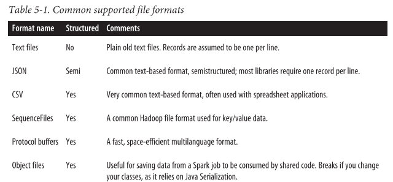

# Loading and Saving Data
  
  Spark can access data through the InputFormat and OutputFormat interfaces used by Hadoop MapReduce, which are available for many common file formats and storage systems - eg. S3, HDFS, Cassandra, HBase, etc
  
  - File Formats and filesystems
    - Data stored in a local or distributed filesystems - NFS, HDFS, S3
    - Spark can access a variety of file formats - text, JSON, Sequence File and Protocol Buffers
  - Structured data sources through Spark SQL
    - Spark SQL API for structured data sources - Apache Hive, etc
  - Databases and Key/value stores
    - built in and third party libraries for connecting to Cassandara, HBase, Elasticsearch and JDBC databases
  ### File Formats
    
  Load and save data in a large number of file formats. Formats range from unstructured like text, to semistructured like JSON, to structured like SequenceFiles.

